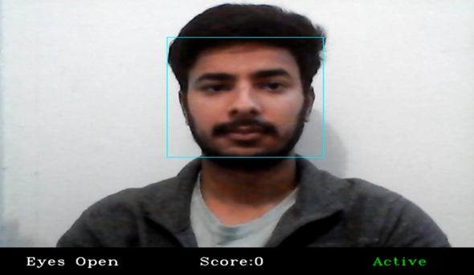
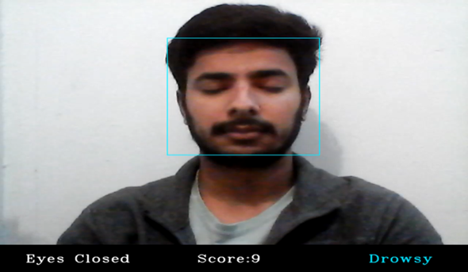
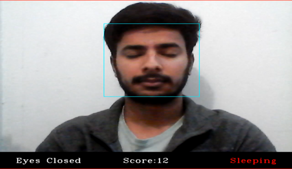

# Drowsiness-Detection-Alert-System
In this project, i have developed a system to detect the level of drowsiness during driving. I have focused on early state detection of drowsiness and alert the driver in advance by
performing the detection of facial features like Eye Aspect Ratio(EAR)and Score value.

I have added three labels at the bottom of the output window to show various possible scenarios in a person’s behavior.
- The first label tells whether the eyes of a person are open or closed and is located at the bottom left of the output window. We have classified the **eye-opening and
closing** based on **EAR value**. If the EAR value is less than the threshold value then we say that the eyes are open, otherwise, we say eyes are closed.
- Secondly, we have the "**Score**" label which is a numerical value. This numerical value keeps on increasing if we have any of the face feature values greater than the threshold values. Similarly, the score value will decrease (can
decrease to zero) if we have all face feature value less than the threshold.
This score value is a very important factor that is going to aid us in determining the state of the third label.
- The third label is a person’s state label. We have divided a person’s behaviour into three states which depends on the face feature’s values.
  - If the score value lies between 0 and 5, then the label will be **Active** and the alarm will be in the deactivated state.
  - If the score value lies between 5 and 10 due to the EAR above threshold, then the label will change to **Drowsy** and the alarm is about to activate.
  - If the score value goes beyond 10, then the label will change to **Sleeping** and the alarm will be activated.
